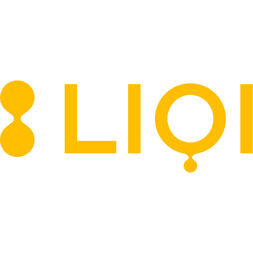

<!-- README.md is generated from README.Rmd. Please edit that file -->

```{r, include = FALSE}
knitr::knit_hooks$set(optipng = knitr::hook_optipng)

knitr::opts_chunk$set(
  collapse = TRUE,
  comment = "#>",
  fig.path = "man/figures/README-",
  out.width = "100%",
  echo = FALSE,
  message = FALSE,
  optipng = "-o1"
)

```

[](liqi.it)

[](https://cran.r-project.org/)


# LIQI <a href="https://liqi.it"></a>

## Introduction

The `LIQI` offers a collection of functions, themes and datasets to enhance productivity on daily coding and reproducibility throughout the organization. 

It is *light on dependencies* (and will be in the future), for better performance and ease of maintenance. It also, as part of the same philosophy, adopts "fully integrated end-to-end platform" production pipeline thanks to the following packages and frameworks:  

- **General Framework**: `data.table` is completely written in base `R` and is blazing fast.
- **Visualization**:   
    - `ggplot2` for static graphics and production-ready plots (the only `tidyverse` package).  
    - `plotly` for interactive graphics as is well-adopted with `rmarkdown` and `shiny`.  
    - `highcharter` for advanced interactive graphics (*coming soon*).  
    - `reactable`: for interactive and static production-ready tables.
    - `reactablefmtr`: for interactive tables and infografics (*Coming soon*).  
    - `bslib` for Shiny apps productiong-grade UI features.. 
- **Reporting**:  
    - `pagedown`: unique framework for PDF + HTML documentation. Fast rendering thanks to `chrome` browsing instead of `LaTeX`.
    - In a near future we plan to migrate `.Rmd` templates to **Quarto** as soon as it is a mature technology.
- **Machine Learning**: `mlr3verse` which seeks a production-ready approach like `python` for `R` and is fully built upon `data.table` and uses `R6` objects (for stability and speed).


### License and Permissions
No license, **for Internal Use only**. It is strictly forbidden to replicate or distribute the code outside the organization. 


## Installation

The development version can be installed from [GitHub](https://github.com/) with:

``` r
# install.packages("remotes")
remotes::install_github("alejandroLiqi/rliqiUW", build_vignettes = TRUE)
```

Stable versions contacting by [email](alejandro@liqi.it). The latest stable version is `1.0.0`.

## Elements

The main components present in the latest stable version are:  
- **`rmarkdown` Report Templates**: 
    - *HTML Doc* for quick and light documents in HTML format.  
    - *Paged Report* for professional looking PDF and HTML reports (lightweight and fast rendering).  
- **`ggplot2` theme**: calling `plot(...) + theme_innteam()`  
- **`reactable` theme**: calling `reactable(..., theme = react_format)`  
- **`plotly` theme**: calling `df %>% plot_ly(...) %>% plotly_innteam()`  
- **Datasets**: tables useful for common issues regarding data cleaning activities (e.g. `codice_ateco` or `decodifica_comuni`).  
- **Operators**: expansions operators to improve readability of code. (`%notin%`, `%contains%`).

It also possible and probably more convenient to set the themes in the session options to avoid verbose code and enable easier reproducibility, especially on documents:  

```
ggplot2::theme_set(theme_liqi())
options(reactable.theme = react_liqi)

```

## Main Functions  

- `clean_names`: transforms into `snake_case` column names: `Nome.1 = nome_1`. 
- `rounder`: helper function to round vectors to the desired closest number: `rounder(93, 5, 'up") = 95`. 
- `diff_years`: calculates the distance in years between to dates. 
- `is.error`, `is.interger64`: helper function that evaluates to boolean. 


## Vignettes

(*Comin soon*) Each functionality and element information and usage can be found in their respective vignette. 

- `vignette("Datasets")` explore Liqi's Team Standard R Theming kit. 
- `vignette("theme_liqi")` Datasets for Daily Activities. 

To access them you may also type `vignette("rliqiUW")` in RStudio for a quick-start guide.


## Claims and Issues

For any doubt, idea or issue please contact us via email to: *alejandro@liqi.it*
